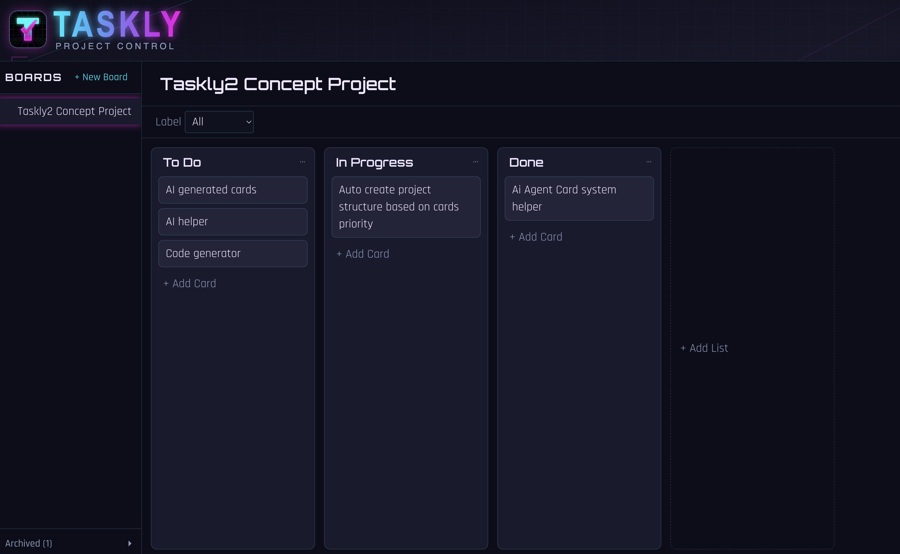

# Taskly

A lightweight, single-user Trello-style project manager: boards → lists → cards, drag-and-drop, global labels, and an archive/restore workflow. Built with Next.js (App Router) and SQLite — no auth, no external services. Styled with a dark, neon-synthwave design system (Agentic FM brand).

See [`docs/ARCHITECTURE.md`](docs/ARCHITECTURE.md) for how it's put together, [`docs/design-system.md`](docs/design-system.md) for the visual design tokens, [`CONTEXT.md`](CONTEXT.md) for the domain glossary, and [`project-manager-plan.md`](project-manager-plan.md) for the feature spec and build order (17 steps complete as of 2026-07-19, including an MCP server for agent access and its extraction into an npm-workspace package — see [`docs/handoff/2026-07-19-mcp-workspace-extraction.md`](docs/handoff/2026-07-19-mcp-workspace-extraction.md) for the latest session notes).



## Getting started

```bash
npm install
npm run dev
```

Open [http://localhost:3000](http://localhost:3000). The SQLite database lives at `data/project-manager.db` and is created (and migrated) automatically on first run — no setup step needed.

## Scripts

| Command | Purpose |
|---|---|
| `npm run dev` | Start the dev server |
| `npm run build` / `npm run start` | Production build / run |
| `npm run lint` | ESLint |
| `npm test` / `npm run test:watch` | Jest unit/component tests |
| `npm run test:e2e` | Playwright end-to-end tests (runs its own dev server against `data/test.db`, see `playwright.config.ts`) |
| `npm run db:generate` | Generate a Drizzle migration from `packages/core/schema.ts` after a schema change |
| `npm run mcp:taskly` | Start the Taskly MCP server (`packages/mcp-server/`) — lets an AI agent list boards/lists/cards and create/edit/move/archive/restore/delete cards outside the browser UI. Already registered in `.mcp.json` as `taskly`; see [`docs/mcp-server-setup.md`](docs/mcp-server-setup.md) for registering it with Claude Desktop, Codex, Gemini CLI/Antigravity, or a Hermes agent. |

## Tech stack

Next.js 16 (App Router) + React 19 + TypeScript, Tailwind CSS v4 with design tokens (Orbitron/Rajdhani/JetBrains Mono via `next/font/google`), `@base-ui/react` for dialogs/menus, `@dnd-kit` for drag-and-drop, Drizzle ORM over `better-sqlite3`, Server Actions for all mutations (no API routes). Jest + Testing Library for unit/component tests, Playwright for E2E.

The app is an npm-workspaces monorepo: the Next.js app stays at the repo root, with its DB schema/mutation logic and MCP server split into their own workspace packages —

```
app/, components/, e2e/ ...   ← Next.js app
packages/
  core/          ← @taskly/core: schema, DB setup, and mutation logic shared by the app and the MCP server
  mcp-server/    ← @taskly/mcp-server: the MCP server, depends on @taskly/core
```

See [`docs/ARCHITECTURE.md`](docs/ARCHITECTURE.md)'s "External/agent access (MCP)" section for why this is a real package boundary rather than the MCP server importing the app's internals directly.
